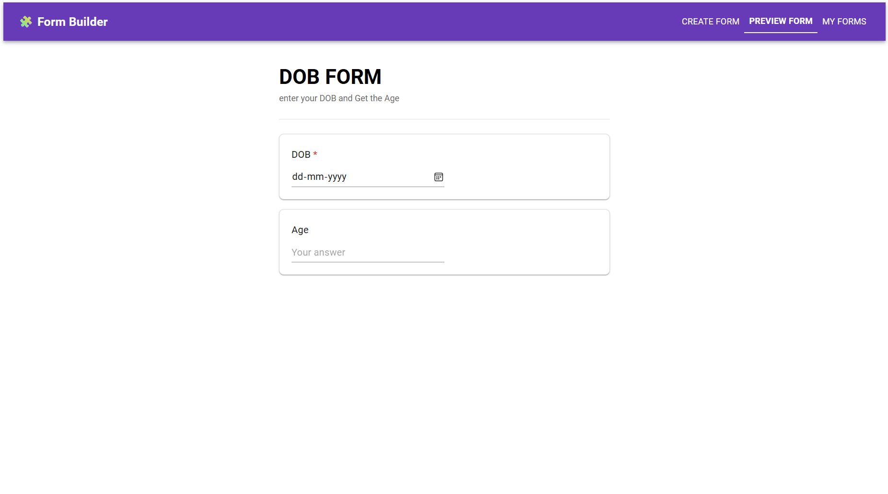

# 🚀 Dynamic Form Builder

> **Build. Customize. Preview. Save.**  
> A modern, no-code **form builder** built with **React + Redux + Material UI** that lets you create beautiful, interactive forms with advanced features like **derived fields** and **live previews**.

---

## 🌟 Overview

The **Dynamic Form Builder** empowers you to create forms dynamically without touching code.  
You can add fields, apply validations, create calculated fields using formulas, preview forms in real-time, and save them for later use.

---

## 🖼️ Screenshots

| Builder | Preview | Saved Forms |
|---------|---------|-------------|
|  |  |  |

---

## ✨ Features

### 🔹 Form Creation
- Add unlimited fields with different input types:
  - Text, Number, Date, Select, Radio, Checkbox, File Upload, etc.
- Drag-and-drop style arrangement (coming soon).

### 🔹 Derived Fields
- Use **formulas** to create fields that automatically compute values.
- Built-in helper functions:
  ```js
  yearsBetween(date)  // Calculate age from DOB
  sum(a, b, c)        // Add multiple values
  concat(str1, str2)  // Merge text values
  upper(str)          // Convert to uppercase
